# PointPillar Waymo 3D Object Detection

This project trains a PointPillar 3D object detector on the Waymo Open Dataset using OpenPCDet framework on HPC clusters.

## 🚀 Results

| Object Class | LEVEL_1 (Easy) | LEVEL_2 (Hard) | Industry Benchmark |
|--------------|-----------------|----------------|--------------------|
| **Vehicle**  | **70.72%**     | **63.05%**     | 65-70%            |
| **Pedestrian** | **67.69%**   | **59.76%**     | 60-65%            |
| **Cyclist**  | **60.53%**     | **57.60%**     | 55-60%            |

## ✨ Key Features

- **360° LiDAR Coverage**: 150m × 150m detection range
- **Multi-class Detection**: Vehicles, pedestrians, cyclists
- **HPC Optimized**: SLURM batch scripts for cluster training
- **State-of-the-art Performance**: Exceeds industry benchmarks

## 🏗️ Architecture

PointPillar converts sparse LiDAR point clouds into dense 2D representations:
1. **Organize points** into vertical columns (pillars)
2. **Apply PointNet** to extract features from each pillar
3. **Use 2D CNN backbone** for efficient processing
4. **Generate 3D bounding boxes** with high accuracy

## 📊 Complete Workflow

```mermaid
graph TD
    A[Waymo Dataset<br/>.tfrecord files] --> B[Data Processing<br/>create_waymo_infos]
    B --> C[Convert to .npy/.pkl<br/>Point clouds + metadata]
    C --> D[Create Groundtruth Database<br/>2.1M individual objects]
    D --> E[Data Augmentation<br/>GT Sampling + Geometric transforms]
    E --> F[PointPillar Model<br/>Pillars → PointNet → 2D CNN]
    F --> G[3D Object Detection<br/>Vehicles, Pedestrians, Cyclists]
    
    H[SLURM Scripts] --> B
    H --> D
    H --> I[Distributed Training<br/>4×GPU, 30 epochs]
    I --> G
    
    J[Configuration Files] --> B
    J --> I
    
    K[OpenPCDet Framework] --> F
    K --> B
    K --> D
    
    style A fill:#e1f5fe
    style G fill:#c8e6c9
    style H fill:#fff3e0
    style K fill:#f3e5f5
```



## 🔄 Training Pipeline

1. **Raw Data**: Waymo .tfrecord files (~1TB)
2. **Processing**: Convert to .npy point clouds + .pkl metadata
3. **Database**: Extract 2.1M individual objects for augmentation
4. **Training**: 4-GPU distributed training with data augmentation
5. **Evaluation**: Automatic validation with mAP metrics
6. **Results**: State-of-the-art 3D object detection performance

## 📁 Project Structure

```
pointpillar-waymo-3d-object-detection/
├── configs/                    # Configuration files
│   ├── waymo_dataset.yaml
│   └── pointpillar_1x.yaml
├── scripts/                    # SLURM batch scripts
│   ├── process_waymo_data.slurm
│   ├── train_pointpillar_waymo_4gpu.slurm
│   └── compile_extensions.slurm
├── results/                    # Training results
│   ├── training_logs/
│   └── evaluation_metrics/
├── docs/                       # Documentation
│   └── medium_blog.md
├── requirements.txt
├── LICENSE
└── README.md
```

## 🚀 Quick Start

### Prerequisites
- HPC cluster with SLURM
- CUDA-capable GPUs
- Python 3.8+
- Waymo Open Dataset

### Setup
1. **Fork OpenPCDet**: [sazzad2024/OpenPCDet](https://github.com/sazzad2024/OpenPCDet)
2. **Clone this repository**:
   ```bash
   git clone https://github.com/sazzad2024/pointpillar-waymo-3d-object-detection.git
   cd pointpillar-waymo-3d-object-detection
   ```
3. **Install dependencies**:
   ```bash
   pip install -r requirements.txt
   ```
4. **Download Waymo dataset** (separately)
5. **Run SLURM scripts**:
   ```bash
   sbatch scripts/process_waymo_data.slurm
   sbatch scripts/train_pointpillar_waymo_4gpu.slurm
   ```

## 📚 Documentation

- **Simple Guide**: [Non-Technical Explanation](README-SIMPLE.md) - Perfect for beginners
- **Technical Guide**: [Complete Technical Documentation](README.md) - For developers and researchers
- **Detailed Blog**: [Technical Blog Post](docs/medium_blog.md) - Comprehensive technical analysis
- **Simple Blog**: [Simple Blog Post](docs/medium_blog_simple.md) - Easy-to-understand explanation
- **Setup Guide**: [Step-by-Step Setup](SETUP.md) - Installation and configuration

## 🔗 Based on OpenPCDet

- **Original framework**: [OpenPCDet](https://github.com/open-mmlab/OpenPCDet)
- **My fork with modifications**: [sazzad2024/OpenPCDet](https://github.com/sazzad2024/OpenPCDet)
- **License**: Apache 2.0

## 📄 License

This project is licensed under the Apache License 2.0 - see the [LICENSE](LICENSE) file for details.

## 🙏 Acknowledgments

- [OpenPCDet](https://github.com/open-mmlab/OpenPCDet) framework by OpenMMLab
- [Waymo Open Dataset](https://waymo.com/open) for providing the dataset
- PointPillar paper: [arXiv:1812.05784](https://arxiv.org/abs/1812.05784)

## 📞 Contact

For questions or collaboration opportunities, please open an issue or contact [A K M Sazzadul Alam](https://github.com/sazzad2024) (MS in Cybersecurity, University of Houston, Texas).

---
**Total project timeline**: 2 weeks  
**Training time**: 18.5 hours  
**Hardware**: 4×GPU, 128GB RAM, 16 CPU cores
